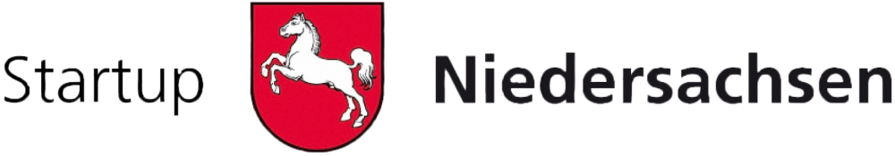

---
title:
subtitle: >-
  Wir vermitteln Ihnen bundesweit Gutachter und Sachverständige. Online und zum Bestpreis!
share-image: images/logo.png
sections:
  - section_id: hero
    component: hero_block.html
    type: heroblock
    image: images/logo.png
    title: FoodHyper
    content: >-
      Wir haben uns zum Ziel gesetzt, die Akteure:innen der niedersächsischen Food-Gründerszene stärker miteinander zu vernetzen und technologische Innovationen in der Lebensmittelbranche zu fördern.
     
       
       

      <button data-tf-popup="E7rHEUEK" data-tf-iframe-props="title=Kontakt" style="background: #FFFFFF;color: #4c5267 !important;height: auto !important;border-radius: 3px;border: 2px solid #b99700;box-sizing: border-box;color: #fff;display: inline-block;font-size: 16px;height: 2.5em;line-height: 1.5;padding: 0.5em 30px;-webkit-transition: opacity 0.15s ease-in-out;transition: opacity 0.15s ease-in-out;font-size: 16px;padding-bottom: 0.625em;padding-top: 0.625em;">Interesse?</button>
  - section_id: FoodHyper
    component: features_block.html
    type: featuresblock
    bg: gray
    title: Was ist FoodHyper?
    subtitle: >-
      Der FoodHyper ist ein <b>Programm zur Förderung von Food-Startups in Niedersachsen</b> für Gründerinnen, Gründer und Gründungsinteressierte der Ernährungsbranche. 
      Es bietet mit seinen unterschiedlichen Formaten sowohl für erste Ideen als auch frühphasige Startups <b>Unterstützung bei Produkt, Geschäftsidee und Netzwerk.</b> 
      Eingebettet in das bestehende Ökosystem verknüpft der FoodHyper bestehende Programme und Akteure:innen und bietet somit den optimalen Anlaufpunkt für Food-Startups.   
       
      FoodHyper ist eine Initiative von <b>startup.niedersachsen.</b>
      Weitere Informationen unter: <a href="https://startup.nds.de/">www.startup.nds.de</a>
       
       
       
       
      
       
       
      
    featureslist:
      - title: Anmeldung Newsletter
        image: images/SVG/undraw_subscriber.svg
        content: >-
          Melde dich jetzt bei unserem <b>Newsletter</b> an und bleibe immer auf dem neuesten Stand! Wir berichten als Unterstützer von Food-Startups regelmäßig über die <b>Food-Gründerszene</b>.
        
           
           

          <button data-tf-popup="V9NX3TAi" data-tf-iframe-props="title=Newsletter Anmeldung" style="background: #b99700;border-radius: 3px;border: 2px solid #b99700;box-sizing: border-box;color: #fff;display: inline-block;font-size: 16px;height: 2.5em;line-height: 1.5;padding: 0.5em 30px;-webkit-transition: opacity 0.15s ease-in-out;transition: opacity 0.15s ease-in-out;font-size: 16px;padding: 0.25em 15px;">Anmelden</button>
      - title: Wir bieten
        image: images/SVG/undraw_online_calendar.svg
        content: >-
         
 Hackathon

         
 Bootcamp

         
 Law 

         
 Netzwerk 

         
      - title: Wir suchen
        image: images/SVG/undraw_people_search.svg
        content: >-
         
 Startups

         
 Akteure:innen

         
 Ideen 

        
  - section_id: recent-posts
    component: posts_block.html
    type: postsblock
    bg: gray
    title: News
  
  - section_id: partner
    component: slider.html
    type: reviewsblock
    bg: white
    title: Unser Team
    images:
      - image: images/logo-innovate.png
        url: https://innovate-os.de/
      - url: https://www.seedhouse.de/
        image: images/Seedhouse_Logo.png
      - url: https://www.dil-ev.de/
        image: images/DIL-Small.png

  # - section_id: reviews
  #   component: reviews_block.html
  #   type: reviewsblock
  #   bg: white
  #   title: Meet the Team
  #   subtitle: >-
  #     FoodHyper
  #   reviews: 
  #     - 
  #       author: Teammitglied 1
  #       avatar: images/avatar.png
  #       content: "Lorem ipsum dolor sit amet, consetetur sadipscing elitr, sed diam nonumy eirmod tempor invidunt ut labore et dolore magna aliquyam erat, sed diam voluptua. At vero eos et accusam et justo duo dolores et ea rebum. Stet clita kasd gubergren, no sea takimata sanctus est Lorem ipsum dolor sit amet. Lorem ipsum dolor sit amet, consetetur sadipscing elitr, sed diam nonumy eirmod tempor invidunt ut labore et dolore magna aliquyam erat, sed diam voluptua. At vero eos et accusam et justo duo dolores et ea rebum. Stet clita kasd gubergren, no sea takimata sanctus est Lorem ipsum dolor sit amet."
  #       link: "https://www.linkedin.com/in/markwarneke/"
  #     - 
  #       author: Teammitglied 2
  #       avatar: images/avatar.png
  #       content: "Lorem ipsum dolor sit amet, consetetur sadipscing elitr, sed diam nonumy eirmod tempor invidunt ut labore et dolore magna aliquyam erat, sed diam voluptua. At vero eos et accusam et justo duo dolores et ea rebum. Stet clita kasd gubergren, no sea takimata sanctus est Lorem ipsum dolor sit amet. Lorem ipsum dolor sit amet, consetetur sadipscing elitr, sed diam nonumy eirmod tempor invidunt ut labore et dolore magna aliquyam erat, sed diam voluptua. At vero eos et accusam et justo duo dolores et ea rebum. Stet clita kasd gubergren, no sea takimata sanctus est Lorem ipsum dolor sit amet."
  #       link: "https://www.linkedin.com/in/maximilian-stein/"
  #     - 
  #       author: Teammitglied 3
  #       avatar: images/avatar.png
  #       content: "Lorem ipsum dolor sit amet, consetetur sadipscing elitr, sed diam nonumy eirmod tempor invidunt ut labore et dolore magna aliquyam erat, sed diam voluptua. At vero eos et accusam et justo duo dolores et ea rebum. Stet clita kasd gubergren, no sea takimata sanctus est Lorem ipsum dolor sit amet. Lorem ipsum dolor sit amet, consetetur sadipscing elitr, sed diam nonumy eirmod tempor invidunt ut labore et dolore magna aliquyam erat, sed diam voluptua. At vero eos et accusam et justo duo dolores et ea rebum. Stet clita kasd gubergren, no sea takimata sanctus est Lorem ipsum dolor sit amet."
  #       link: "https://www.linkedin.com/in/maxleimkuehler/"
      
layout: home
---
